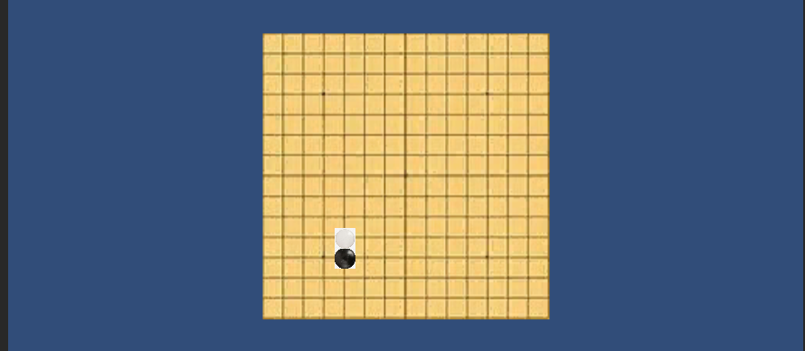

## unity-五子棋

使用unity完成五子棋。

### 题目


### 游戏介绍

本游戏是一个简单的二维五子棋小游戏。游戏为单人模式，由黑方先开始，交替进行，先连成五子者获胜。

游戏开始界面如下。


点击屏幕相应位置进行走子，如下图。




连成五子后游戏结束，提示胜方，如下图。


### 代码实现

资源方面，从网络上下载了一个简易的棋盘、黑白棋子素材，用windows画图绘制了黑白棋的胜利提示图，如下。


我们需要在一个平面上放棋盘。为了进行棋子的定位，需要在四个角落用小球进行定位，如下。


定义一个脚本代码main，挂载到主相机上，将各种物件挂载到脚本，如下。


脚本代码如下。Start函数进行初始化，Update主要为了响应鼠标点击活动，judge用于判断是否获胜与胜者是何方，OnGUI用于UI绘制。代码细节已经给出注释进行解释。

```csharp
using System.Collections;
using System.Collections.Generic;
using UnityEngine;
enum side{empty,black,white};
public class main : MonoBehaviour
{
    // Start is called before the first frame update
    //分别是左上、右上、左下、右下四个位点以及其坐标
    public GameObject leftup;
    Vector3 leftupPos;
    public GameObject rightup;
    Vector3 rightupPos;
    public GameObject leftdown;
    Vector3 leftdownPos;
    public GameObject rightdown;
    Vector3 rightdownPos;
    //现在点击的位置
    Vector3 TapPos;
    //相机
    public Camera maincam;
    //黑棋与白棋
    public Texture2D wChess;
    public Texture2D bChess;
    //黑白棋的胜利界面
    public Texture2D w_win;
    public Texture2D b_win;
    //网格的长宽，下面start中进行计算
    float grid_width = 0;
    float grid_height = 0;
    float minofWidthHeight = 0;
    float min_judge = 0;
    bool playing = true;
    side winner = side.empty;//胜者
    side chessturn = side.black;//记录到哪一方落子，规则中为黑方先落子
    side[,] chessState;
    Vector2[,] chessPos;
    int max(int a,int b){
        return a > b ? a : b;
    }
    int min(int a,int b){
        return a < b ? a : b;
    }
    void Start()
    {
        //初始化
        chessPos = new Vector2[15,15];
        chessState = new side[15,15];
        //记录四角位置，这是为了定位网格点位置的措施
        leftupPos = maincam.WorldToScreenPoint(leftup.transform.position);
		rightupPos = maincam.WorldToScreenPoint(rightup.transform.position);
		leftdownPos = maincam.WorldToScreenPoint(leftdown.transform.position);
		rightdownPos = maincam.WorldToScreenPoint(rightdown.transform.position);
        grid_width = (rightupPos.x - leftupPos.y)/14;
        grid_height = (leftupPos.y - leftdownPos.y)/14;
        if(grid_height == grid_width){
            Debug.Log("same");
        }
        else{
            Debug.Log("diff");
        }
        minofWidthHeight = grid_height > grid_width ? grid_width : grid_height;
        min_judge = minofWidthHeight / 2;
        for(int i = 0;i < 15;++i){
            for(int j = 0;j < 15;++j){
                chessPos[i,j] = new Vector2(leftdownPos.x + grid_height * i,leftdownPos.y + grid_height * j);
            }
        }
    }

    // Update is called once per frame
    void Update()
    {
        //每次更新，主要是相应鼠标点击这一活动
        side winside = side.empty;
        if(playing && Input.GetMouseButtonDown(0)){
            //响应鼠标点击
            TapPos = Input.mousePosition;
            for(int i = 0;i < 15;++i){
                for(int j = 0;j < 15;++j){
                    //在相应位置更新棋子状态
                    if(chessState[i,j] == side.empty && distance(TapPos,chessPos[i,j]) < min_judge){
                        chessState[i,j] = chessturn;
                        winside = judge(i,j,chessturn);
                        if(chessturn == side.black){
                            chessturn = side.white;
                        }
                        else{
                            chessturn = side.black;
                        }
                    }
                }
            }
        }
        if(winside != side.empty){
            Debug.Log("win");
            playing = false;
            winner = winside;
        }
    }
    //胜利判断：返回胜方或empty（即尚未分出胜负）
    //以下出的该棋子为中心进行判断
    side judge(int x,int y,side turnside){
        //行判断
        int left = (x - 4 >= 0 ? x - 4 : 0);
        int right = (x + 4 < 15 ? x + 4 : 14);
        int contin = 0;
        for(int i = left;i <= right;++i){
            if(chessState[i,y] == turnside){
                ++contin;
                if(contin == 5){
                    return turnside;
                }
            }
            else{
                contin = 0;
            }
        }
        //列判断
        int down = (y - 4 >= 0 ? y - 4 : 0);
        int up = (y + 4 < 15 ? y + 4 : 14);
        contin = 0;
        for(int i = down;i <= up;++i){
            if(chessState[x,i] == turnside){
                ++contin;
                if(contin == 5){
                    return turnside;
                }
            }
            else{
                contin = 0;
            }
        }
        //从左到右对角线判断
        contin = 0;
        for(int j = -4;j <= 4;++j){
            if(x + j >= 0 && x + j <= 14 && y + j >= 0 && y + j <= 14 && chessState[x+j,y+j] == turnside){
                contin++;
                if(contin == 5){
                    return turnside;
                }
            }
        }
        //从右到左对角线判断
        contin = 0;
        for(int j = -4;j <= 4;++j){
            if(x + j >= 0 && x + j <= 14 && y - j >= 0 && y - j <= 14 && chessState[x+j,y-j] == turnside){
                contin++;
                if(contin == 5){
                    return turnside;
                }
            }
        }
        return side.empty;
    }
    //接口：计算鼠标点击位置和网格位置的相对距离
    float distance(Vector3 pos1,Vector2 pos2){
        return Mathf.Sqrt(Mathf.Pow(pos1.x - pos2.x,2) + Mathf.Pow(pos1.y - pos2.y,2));
    }
    //OnGUI用于绘制图像
    void OnGUI() {
        for(int i = 0;i < 15;++i){
            for(int j = 0;j < 15;++j){
                //绘制黑白棋
                if(chessState[i,j] == side.black){
                    GUI.DrawTexture(new Rect(chessPos[i,j].x-grid_height/2, Screen.height-chessPos[i,j].y-grid_height/2, grid_height,grid_height),bChess);
                }
                else if(chessState[i,j] == side.white){
                    GUI.DrawTexture(new Rect(chessPos[i,j].x-grid_height/2, Screen.height-chessPos[i,j].y-grid_height/2, grid_height,grid_height),wChess);
                }
            }
        }
        //绘制胜利窗口
        if(winner == side.black){
            GUI.DrawTexture(new Rect(Screen.width * 0.1f, Screen.height * 0.1f, Screen.width * 0.2f, Screen.height * 0.1f), b_win);
        }
        else if(winner == side.white){
            GUI.DrawTexture(new Rect(Screen.width * 0.1f, Screen.height * 0.1f, Screen.width * 0.2f, Screen.height * 0.1f), w_win);
        }
    }
}

```


